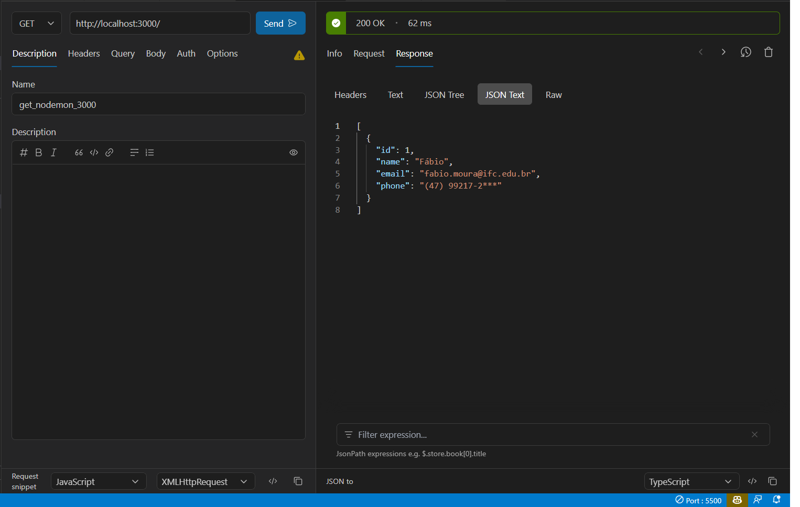
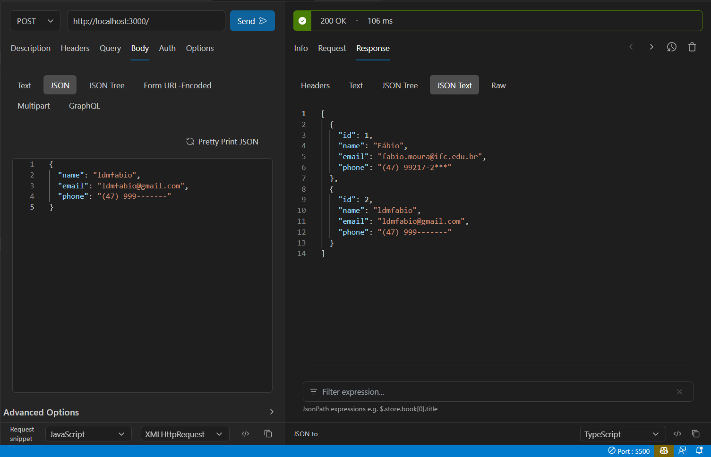
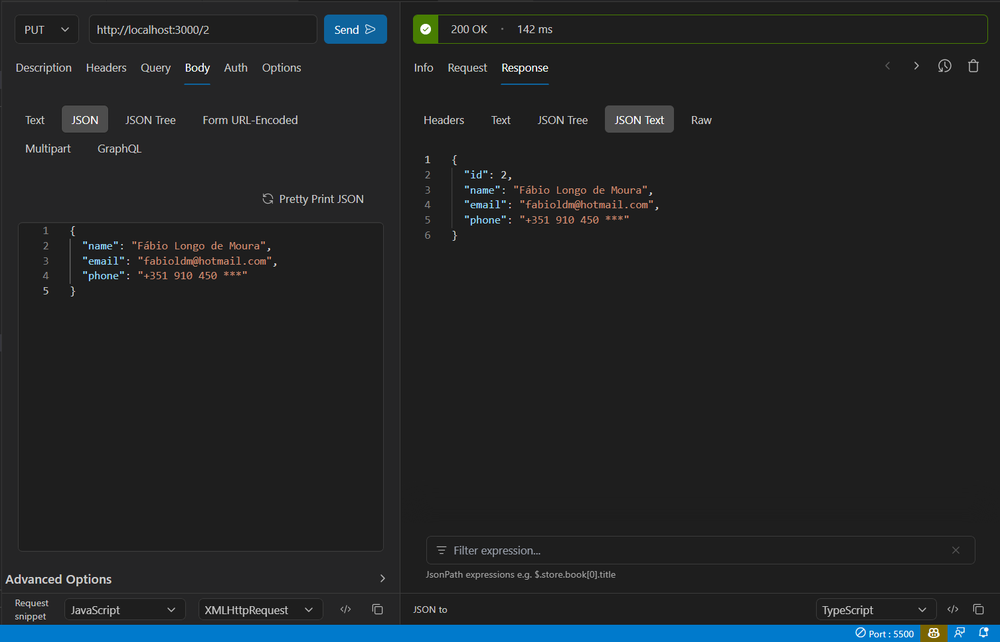
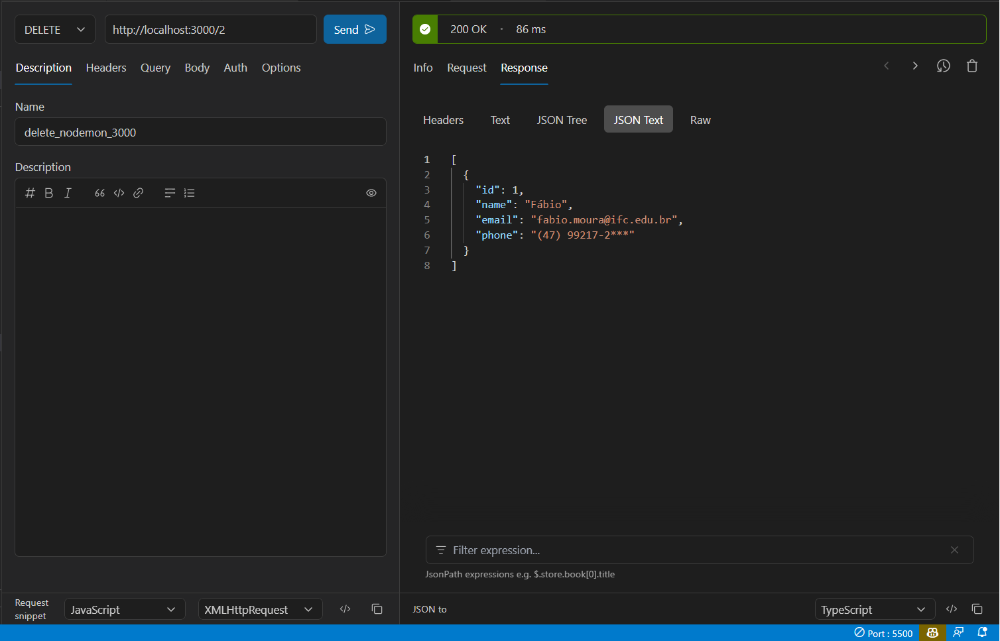

# Creating a Node.js Server

_*This content was extracted from [Operações de CRUD em arquivo JSON usando JavaScript](https://www.youtube.com/watch?v=M7uMuGIlA98)._

The basic steps to create this Node.js server are:

```
> npm init -y
```
```
> npm install --save express
```
```
> npm install --save nodemon
```


You need to change some values of [package.json](package.json) file. These values are:
- **name**: you can use your ID/name. In my case, I used *ldmfabio*
- In *scripts*, the value of "dev" needs to be **"nodemon"**

In the [package-lock.json](package-lock.json) file, all the value of _name_ was changed to **"ldmfabio"**.

> The port number were the _back end_ will be availeble was established at the last line of [index.js](index.js) file

Now you need to pay attention to the [index.js](index.js) file. In this file are all the HTML methods to alter the JSON file, where contains the data of the server.

To run the server, you need to use the command:
```
> npm run dev
```

For CRUD operations, you may use some tools like Postman or RapidAPI Client (my preferred one).

## RapidAPI
The JSON file (items.json) at the beginner is:

```JSON
[
    {
        "id": 1,
        "name": "Fábio",
        "email": "fabio.moura@ifc.edu.br",
        "phone": "(47) 99217-2***"
    }
]
```
 
 After _npm run dev_ command, you can use the RapidAPI Client to do this is simple. You need to create a new request, set the method (GET, POST, PUT, DELETE), the URL (http://localhost:3000/ - after _npm run dev_ being executed) and the body (if necessary).

## Get Method
See the image below to see how to use the GET method and the result of this method.



_Click at the **Send** button to see the result of the GET method._

## Post Method
See the image below to see how to use the POST method and the result of this method.



_Click at the **Send** button to see the result of the POST method._

As you can see in the right side of the image, the JSON file was updated with the new data. Now, we have two records in the JSON file.

## Put Method
See the image below to see how to use the PUT method and the result of this method.



_Click at the **Send** button to see the result of the PUT method._

As you can see in the right side of the image, the JSON file was updated with the new data displayed on the left side of the image. Beyond that, the PUT method is used to update the data of a specific record. In this case, the record with the ID 2 was updated. This parameter was set in the URL of the PUT method.

## Delete Method
See the image below to see how to use the DELETE method and the result of this method.



_Click at the **Send** button to see the result of the DELETE method._

As you can see in the right side of the image, the JSON file was updated, but now, the record with the ID 2 was deleted. This ID was used in the DELETE method as a parameter.