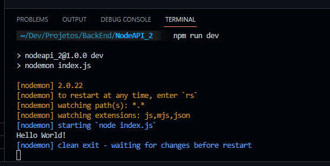
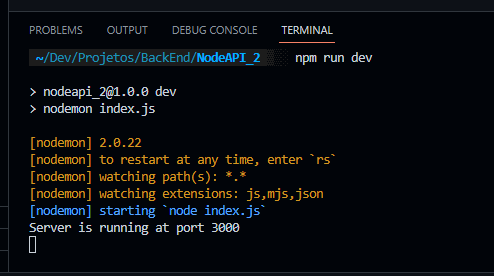
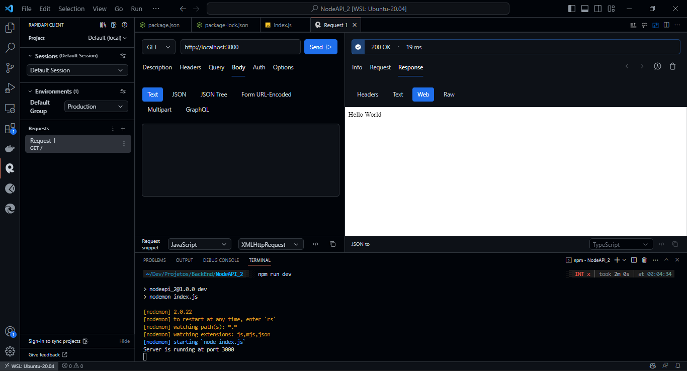
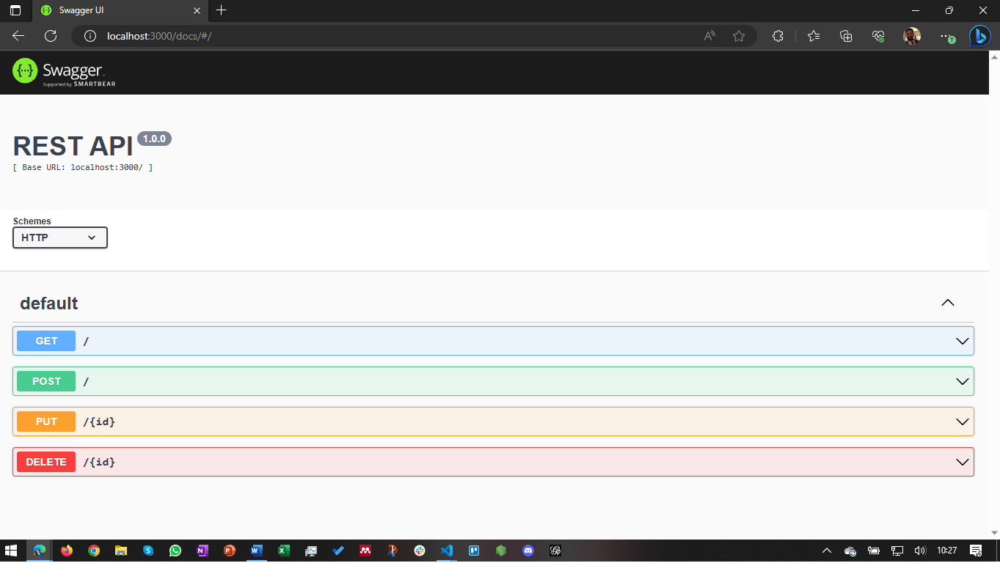

# Creating a Node.js Server

_\*This content was extracted from [Operações de CRUD em arquivo JSON usando JavaScript](https://www.youtube.com/watch?v=M7uMuGIlA98)._

The basic steps to create this Node.js server are:

```
> npm init -y
```

With this command, you will create the [package.json](package.json) file. This file will be used to store all the dependencies of the project.

```
> npm install --save express
```

With this command, you will install the express dependency. This dependency will be used to create the server. After this command, you will see that the [package.json](package.json) file was updated with the express dependency. Beyond that, a new folder was created. This folder is the **node_modules** folder. This folder will store all the dependencies of the project. Another file was created. This file is the [package-lock.json](package-lock.json) file. This file will store all the dependencies of the project too.

```
> npm install --save nodemon
```

With this command, you will install the nodemon dependency. This dependency will be used to restart the server automatically when you change some code of the project. After this command, you will see that the [package.json](package.json) file was updated with the nodemon dependency.

Now you need to change some values of [package.json](package.json) file. These values are:

- **name**: you can use your ID/name. In my case, I used _ldmfabio_
- In _scripts_, the value of "dev" needs to be **"nodemon"**

The content of the [package.json](package.json) file after the changes is:

```JSON
{
  "name": "nodeapi_2",
  "version": "1.0.0",
  "description": "",
  "main": "index.js",
  "scripts": {
    "dev": "nodemon index.js",
    "test": "echo \"Error: no test specified\" && exit 1"
  },
  "keywords": [],
  "author": "ldmfabio",
  "license": "ISC",
  "dependencies": {
    "express": "^4.18.2",
    "nodemon": "^2.0.22"
  }
}
```

In the [package-lock.json](package-lock.json) file, all the value of _name_ was changed to **"ldmfabio"**.

## index.js

Now you need to create the [index.js](index.js) file. This file will be the main file of the project. In this file, you will create the server. The content of this file is:

```
console.log(`Hello World!`);
```

You can run the server with the command:

```
> npm run dev
```

The result of this command is:



## Creating the server

Now you need to create the server. To do this, you need to change the [index.js](index.js) file. The content of this file is:

```JavaScript
const express = require('express');
const server = express();
const router = express.Router();

server.use(express.json({extended: true}));
server.use(router);

server.listen(3000, () => {
    console.log(`Server is running at port 3000`);
});
```

- Line 1: you import the express dependency.
- Line 2: you create the server.
- Line 3: you create the router.
- Line 5: you set the server to use the JSON format.
- Line 6: you set the server to use the router.
- Line 8: you set the server to listen the port 3000.

Now, if you run the server with the command:

```
> npm run dev
```

The result of this command is:
<br>


## Router

Now you need to create the router (Get, Post, Put, Delete). To do this, you need to change the [index.js](index.js) file. Before of the code _server.use(router)_, you need to add the following code:

```JavaScript
router.get("/", (req, res) => {
    res.send("Hello World");
});
```

For CRUD operations, you may use some tools like Postman or RapidAPI Client (my preferred one).

## RapidAPI

As we are using the RapidAPI Client, you need to install it. To do this, you need click at the extensions button of the VSCode and search for RapidAPI Client. After the installation, you need to restart the VSCode.

We already have a route to use the GET method. So, if you are running your server (npm run dev), you may use the RapidAPI Client to see how it works. You need to create a new request using the GET method. Click at the RapidAPI Client button and click at the **+** button. After this, you need to set the method (GET), the URL (http://localhost:3000/ - after _npm run dev_ being executed) and click at the **Send** button. The result of this request is:


## Creating router (Post, Put, Delete)

For now, you have just to Copy and Paste the Get method and change the method (Post, Put, Delete). The code of the [index.js](index.js) file is:

```JavaScript
const express = require("express");
const server = express();
const router = express.Router();

server.use(express.json({ extended: true }));

router.get("/", (req, res) => {
    res.send("Hello World");
});

router.post("/", (req, res) => {
  res.send("Hello World");
});

router.put("/", (req, res) => {
  res.send("Hello World");
});

router.delete("/", (req, res) => {
  res.send("Hello World");
});

server.use(router);

server.listen(3000, () => {
  console.log(`Server is running at port 3000`);
});
```

## Creating the JSON file

We will manipulate a JSON file. So, you need to create a JSON file. To create this file, you first need to create a new folder. It's name will be **data**. The JSON file will be created inside of this folder. The name of the file will be **items.json**. The content of this file is:

```JSON
[
    {
        "id": 1,
        "name": "Fábio",
        "email": "fabio.moura@ifc.edu.br",
        "phone": "(47) 99217-2***"
    }
]
```

## Get Method

To use the GET method, you need to change the [index.js](index.js) file. After the line const router = express.Router();, you need to add the following code:

```JavaScript
const fs = require("fs");
```

Beyond this, you need to change the GET method. The new code of the GET method is:

```JavaScript
router.get("/", (req, res) => {
    const content = fs.readFileSync("./data/items.json", "utf-8");
    res.send(JSON.parse(content, ));
});
```

See the image below to see how to use the GET method at the RapidAPI and the result of this method.


_Click at the **Send** button to see the result of the GET method._

We will read the same JSON file in all of our methods. So, to get easier, we will create a function to read the JSON file. The code of this function, that will be placed at [index.js](index.js) file after the server.use(express.json({ extended: true })); line, is:

```JavaScript
const readFile = () => {
    const content = fs.readFileSync("./data/items.json", "utf-8");
    return JSON.parse(content);
};
```

As we will use this function in all of our methods, we need to change the GET method. The new code of the GET method is:

```JavaScript
router.get("/", (req, res) => {
    const content = readFile();
    res.send(content);
});
```

## Post Method

Again, to use the Post Method, you need to change the [index.js](index.js) file.

We can create a function to write the new content in the [items.json](./data/items.json) file.

The code of this function may be places after the readFile() function. It's code follows below:

```JavaScript
const writeFile = (content) => {
  const updateFile = JSON.stringify(content);
  fs.writeFileSync("./data/items.json", updateFile, "utf-8");
}
```

The Post Method lines that will be necessary to send the new content for [items.json](./data/items.json) file is:

```JavaScript
router.post("/", (req, res) => {
  const { name, email, phone } = req.body;
  const currentContent = readFile();
  const id = currentContent.lenngth + 1;
  currentContent.push({ id, name, email, phone });
  writeFile(currentContent);
  res.send(currentContent);
});
```

See the image below to see how to use the POST method and the result of this method.


_Click at the **Send** button to see the result of the POST method._

As you can see in the right side of the image, the [items.json](./data/items.json) file was updated with the new data. Now, we have two records in this file.

## Put Method

The Put Method will be useful to update data contained in the [items.json](./data/items.json) file.

We need to change the router.put because we need to specify the ID related to the data that will be updated. So, the entire code of router.put will be:

```JavaScript
router.put("/:id", (req, res) => {
  const { id } = req.params;
  const { name, email, phone } = req.body;
  const currentContent = readFile();
  const selectedItem = currentContent.findIndex((item) => item.id == id);
  const {
    id: cId,
    name: cName,
    email: cEmail,
    phone: cPhone,
  } = currentContent[selectedItem];

  const newObject = {
    id: cId,
    name: name ? name : cName,
    email: email ? email : cEmail,
    phone: phone ? phone : cPhone,
  };

  currentContent[selectedItem] = newObject;
  writeFile(currentContent);
  res.send(newObject);
});
```

See the image below to see how to use the PUT method and the result of this method.


_Click at the **Send** button to see the result of the PUT method._

As you can see in the right side of the image, the JSON file was updated with the new data displayed on the left side of the image. Beyond that, the PUT method is used to update the data of a specific record. In this case, the record with the ID 2 was updated. This parameter was set in the URL of the PUT method.

## Delete Method

To delete some items of [items.json](./data/items.json) file, like previous method (PUT), we also need to specify the ID related to register that will be deleted.

Because of this, we will also need to change the router.delete. The complete code of this method is:

```JavaScript
router.delete("/:id", (req, res) => {
  const { id } = req.params;
  const currentContent = readFile();
  const selectedItem = currentContent.findIndex((item) => item.id === id);
  currentContent.splice(selectedItem, 1);
  writeFile(currentContent);
  res.send(currentContent);
});
```

See the image below to see how to use the DELETE method and the result of this method.


_Click at the **Send** button to see the result of the DELETE method._

As you can see in the right side of the image, the JSON file was updated, but now, the record with the ID 2 was deleted. This ID was used in the DELETE method as a parameter.

# Making Swagger Documentation

_\*This content was extracted from [Como automatizar documentação de APIs REST em Node.js com Swagger?](https://www.letscode.com.br/blog/como-automatizar-documentacao-de-apis-rest-em-nodejs-com-swagger)_.

You first need to instal some npm dependencies. These dependencies are:

**swagger-ui-express, swagger-autogen and body-parser**

So, to install these dependencies, you need to use the command:

```
npm install --save swagger-ui-express swagger-autogen body-parser
```

Please verify if the dependencies were installed in the [package.json](package.json) file.

Now we need to create a new file and a new folder. The new file and folder are:

- **FILE:** swagger.js (at root folder)
- **FOLDER:** folder swagger (at root folder)
  > _Both will be created at root folder_

## **swagger.js**

In this file, the code will be like this:

```javascript
const swaggerAutogen = require("swagger-autogen")();

const outputFile = "swagger/swagger_output.json";

const endPointsFiles = ["index.js"];

swaggerAutogen(outputFile, endPointsFiles);
```

Note that the swagger.js file will be used to generate the swagger_output.json file. This file will be used to generate the Swagger documentation.

The swagger documentation will be generated from the index.js file. This file contains all the methods to alter the JSON file.

## **swagger folder**

You don't need to create any file in this folder. The swagger-autogen will create all the files necessary to generate the Swagger documentation. This folder will just serve to store the files generated by swagger-autogen.

## **index.js**

At this file, you need to add some lines of needed code to generate the Swagger documentation. These lines are:

```javascript
const bodyParser = require("body-parser");
const swaggerUi = require("swagger-ui-express");
const swaggerFile = require("./swagger/swagger_output.json");
```

> \*_Suggestion: add these lines after the line 1 of the index.js file._

Also in the index.js file, you need to add some other lines of code to generate the Swagger documentation. These lines are:

```javascript
server.use("/docs", swaggerUi.serve, swaggerUi.setup(swaggerFile));
server.use(express.json({ extended: true }));
server.use(bodyParser.urlencoded({ extended: false }));
```

> \*_Suggestion: add these lines before reading the JSON file (line 7 of the index.js file)._

## **swagger docs**

To generate the Swagger documentation, we need to change the [package.json](package.json) file. In this file, we need to go to section scripts to add swagger-autogen, according to the code below:

```javascript
"scripts": {
  "start": "nodemon index.js",
  "swagger-autogen": "node swagger.js",
},
```

Now, to generate the Swagger documentation, you need to use the command:

```
npm run swagger-autogen
```

> _Pay attention at the swagger folder. Now you will se the file swagger_output.json. This file was generated based on the index.js file and their methods._

To see the documentation, you just need to run the server and access the URL http://localhost:3000/docs. The result will be like this:



# References

- [Operações de CRUD em arquivo JSON usando JavaScript.](https://www.youtube.com/watch?v=M7uMuGIlA98)
- [Como automatizar documentação de APIs REST em Node.js com Swagger?](https://www.letscode.com.br/blog/como-automatizar-documentacao-de-apis-rest-em-nodejs-com-swagger)

## **If you have any questions, please contact me.**

- e-Mail: [ ldmfabio@gmail.com](mailto:ldmfabio@gmail.com) | [fabio.moura@ifc.edu.br](mailto:fabio.moura@ifc.edu.br)
- GitHub: [github.com/ldmfabio](https://github.com/ldmfabio)
- LinkedIn: [linkedin.com/in/ldmfabio](https://www.linkedin.com/in/ldmfabio/)
- WhatsApp: [+55 (47) 99217-2425](https://api.whatsapp.com/send?phone=5547992172425)
